# ABHISHEK KUMAR · GitHub Profile

<p align="center">
  
</p>

<p align="center">
  
</p>

<p align="center">
  
</p>

<p align="center">
  
</p>

<p align="center">
  
</p>

---

## 🚀 Projects

| Project | What it is | Repository |
|---|---|---|
| **STUDYHUB** | Study material platform for students | [Open](https://github.com/Abhishek1123-kr/STUDYHUB) |
| **CLONE-GNUMIS-PU25** | University portal clone | [Open](https://github.com/Abhishek1123-kr/CLONE-GNUMIS-PU25) |
| **pyhtonGCF-project** | Personal chat-room project | [Open](https://github.com/Abhishek1123-kr/pyhtonGCF-project) |
| **Rakhi2025** | Raksha Bandhan themed web project | [Open](https://github.com/Abhishek1123-kr/Rakhi2025) |
| **GitHub-Achievements** | GitHub profile badge reference | [Open](https://github.com/Abhishek1123-kr/GitHub-Achievements) |

---

## 🔗 Links

<p align="center">

<a href="https://github.com/Abhishek1123-kr">
  
</a>

<a href="https://www.linkedin.com/in/abhishek1123-kr">
  
</a>

<a href="https://leetcode.com/u/Abhishek1123-kr/">
  
</a>

<a href="https://abhishekkumar-1123.vercel.app/">
  
</a>

</p>

---

## 👨‍💻 About Me

I'm **Abhishek Kumar**, a B.Tech Computer Science & Engineering student at **Parul University**.

I enjoy building practical software projects, exploring AI-powered applications, experimenting with full-stack development, and learning cloud and modern web technologies.

### Currently Exploring

- 🤖 Artificial Intelligence & AI Agents
- 🌐 Full-Stack Web Development
- 🧠 Machine Learning
- ☁️ Cloud Computing
- 🔐 Cybersecurity & Privacy
- 🧩 Browser Automation
- 📱 Modern Developer Tools

---

## 🛠️ Technology Stack

### Languages

<p>
  
  
  
  
  
</p>

### Frontend

<p>
  
  
  
  
  
</p>

### Backend & Database

<p>
  
  
  
  
  
  
</p>

### Cloud & Tools

<p>
  
  
  
  
  
  
</p>

---

## 🧠 Featured Work

### 🔵 Peroter

**Privacy-First Visual Browser Agent**

A privacy-focused browser automation system designed around on-device visual perception and safe browser interaction.

**Focus areas:**

- On-device visual perception
- Browser automation
- Privacy-preserving AI
- WebGPU / WebAssembly
- Vision-based interaction
- Secure action execution

---

### 🟣 StudyHub

A student-focused academic platform designed to organize:

- Notes
- Assignments
- PPTs
- Lab manuals
- Syllabus
- Study resources

Built with modern web technologies and designed around a clean student experience.

---

### 🔴 AVIC AI Friend

An AI-powered virtual companion with:

- Context-aware conversations
- AI image understanding
- Long-term memory
- Personalization
- Secure authentication
- Supabase backend
- Modern React interface

---

## 🎯 Current Focus

```text
AI
├── AI Agents
├── Computer Vision
├── Local / On-Device AI
└── Intelligent Automation

Development
├── Full-Stack Applications
├── React + TypeScript
├── Python
└── Backend Systems

Cloud
├── AWS
├── Google Cloud
├── Supabase
└── Docker

Security
├── Privacy
├── Secure Automation
└── Browser Security
